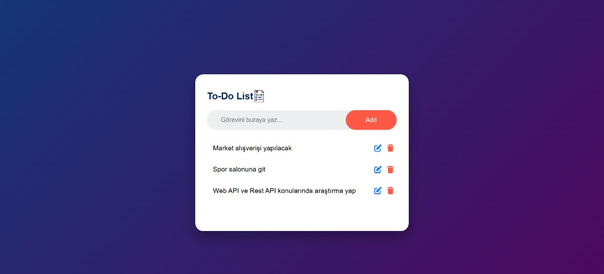

# 🚀 Modern To-Do API & Web UI

Bu proje, bir Full-Stack geliştirme pratiği olarak tasarlanmıştır. Backend tarafında ASP.NET Core Web API, frontend tarafında ise Vanilla JavaScript kullanılarak geliştirilen, tamamen ayrık (decoupled) bir mimariye sahiptir.

## 🛠️ Kullanılan Teknolojiler
- Backend: ASP.NET Core 8.0, Entity Framework Core

- Database: SQL Server (veya kullandığın DB ismi)

- Frontend: HTML5, CSS3 (Modern UI), Vanilla JavaScript

- Mimari: REST API, Service Response Pattern, Repository Pattern

- Araçlar: Swagger UI, Postman

## 🌟 Öne Çıkan Özellikler
- RESTful API: CRUD (Create, Read, Update, Delete) operasyonları standartlara uygun şekilde geliştirildi.

- Generic Service Response: API yanıtları, frontend ile tutarlı bir iletişim sağlamak adına generic bir yapı (ServiceResponse<T>) ile sarmalandı.

- Modern Soft UI: Kullanıcı deneyimini ön planda tutan, "soft" ve şık bir arayüz tasarlandı.

- CORS Policy: Farklı kaynaklardan gelen istekleri güvenli bir şekilde karşılamak için CORS yapılandırması uygulandı.

- Async/Await: Tüm veritabanı işlemleri asenkron olarak kurgulanarak performans optimizasyonu sağlandı.

## 📋 Kurulum ve Çalıştırma
- Backend:

    - appsettings.json dosyasındaki Connection String'i kendi veritabanınıza göre güncelleyin.

    - Package Manager Console üzerinden Update-Database komutunu çalıştırın.

    - Projeyi başlatın (Varsayılan: https://localhost:7212).

- Frontend:

    -  app.js dosyasındaki BASE_URL değişkeninin API portu ile eşleştiğinden emin olun.

    - index.html dosyasını tarayıcınızda açın.

### 📈 Öğrendiklerim ve Gelişim
- Bu proje sürecinde; API ve Frontend entegrasyonu, Fetch API kullanımı, JavaScript ile DOM manipülasyonu ve asenkron programlama konularında derinlemesine tecrübe kazandım. Ayrıca, kurumsal projelerde yaygın olarak kullanılan ServiceResponse desenini uygulayarak temiz kod (clean code) prensiplerini pekiştirdim.
